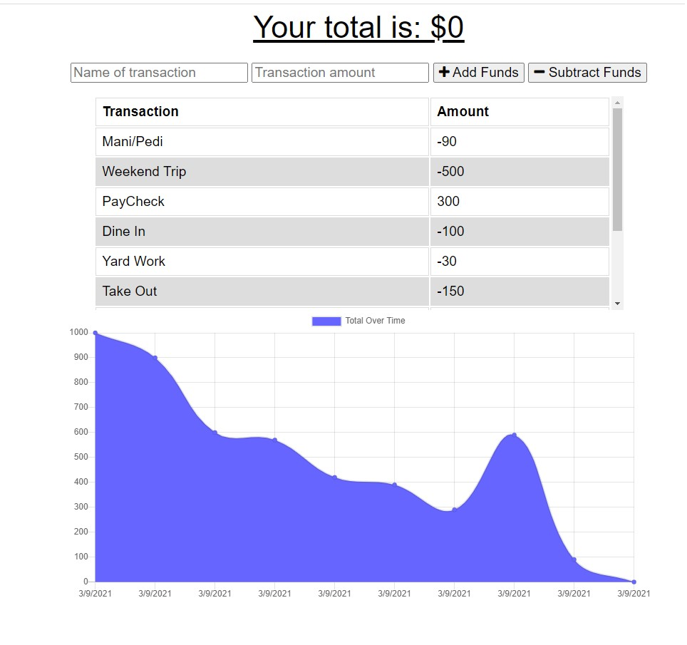
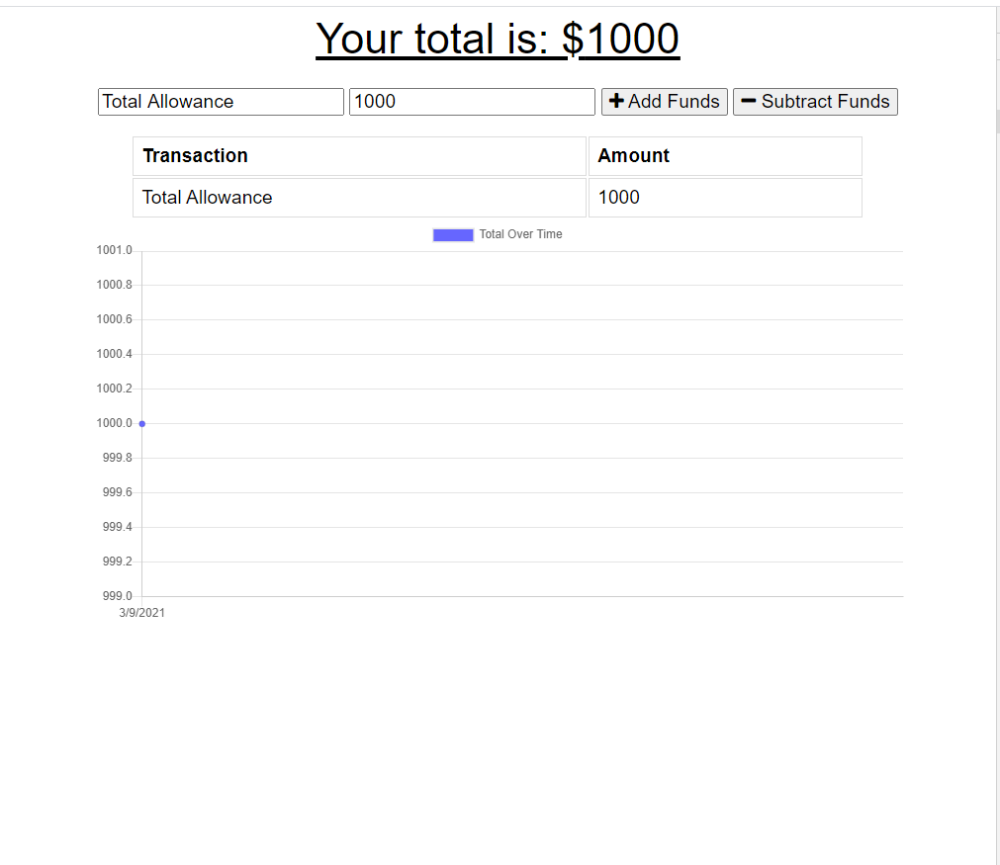
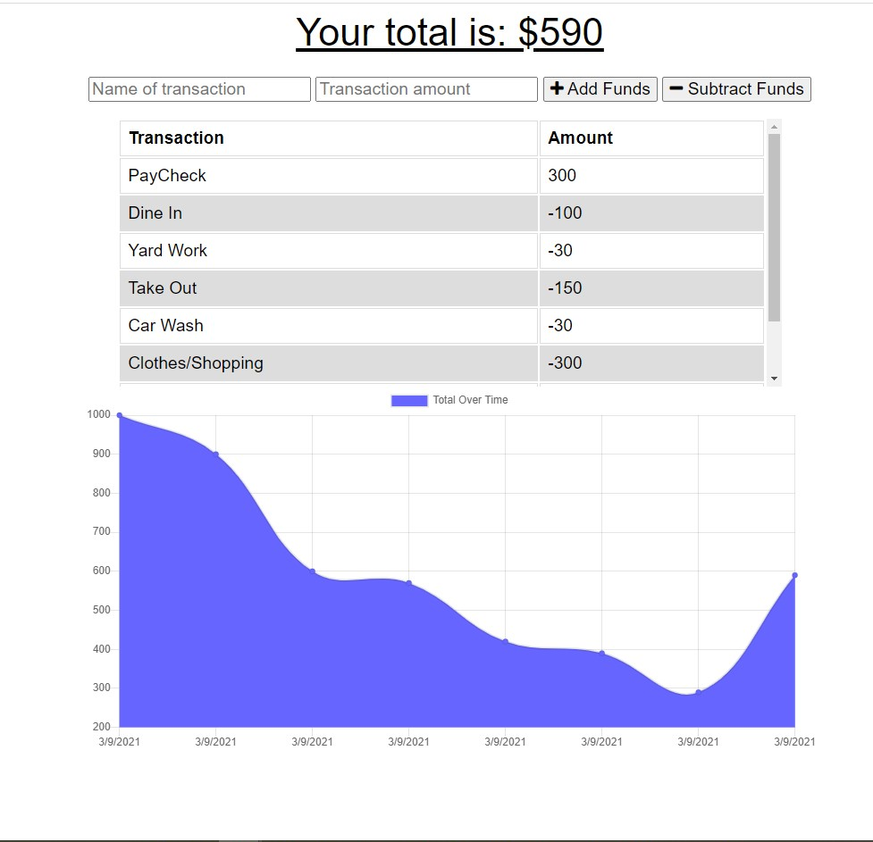

# Budget Tracker [](https://opensource.org/licenses/MIT)

## Table of Contents
  * [Description](#Description)
  * [User Story](#User-Story)
  * [Contributors](#Contributors)
  * [Language/Technoligies Used](#Language/Technologies-Used)
  * [Mock-Up](#Mock-Up)    
  * [Repository](#Repository-Link)
  * [Questions](#Questions)


## Description 
This Budget Tracker, a PWA (Progressive Web App), allows the user to add or subtract funds accordingly. It organizes the transactions from oldest (bottom) to newest(top) as well as display graph to visually display the users budget history.

## User Story
```
AS AN avid traveller

I WANT to be able to track my withdrawals and deposits with or without a data/internet connection

SO THAT my account balance is accurate when I am traveling
```
## Contributors
 [Janneth Alvarado Verduzco](https://github.com/jannverduzco) - janneth_verduzco@live.com


## Language/Technologies Used
* HTML
* CSS
* JavaScript
* NPM package(Package.json)
   * Express
   * mongoose
   * morgan
   * compression
* Heroku (Deployment)
* ESLint (Testing code)

## Mock-Up 

### Budget Tracker


### Adding Funds


### Subtracting Funds


### Online/Offline


## Live Link (Heroku)
### https://bdg-tracker.herokuapp.com/

## Repository Link
### https://github.com/jannverduzco/Budget-Tracker

 ## Questions
 Please contact me direclty at [janneth_verduzco@live.com](janneth_verduzco@live.com) with any questions or suggestions.